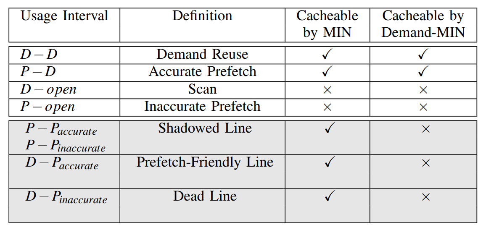
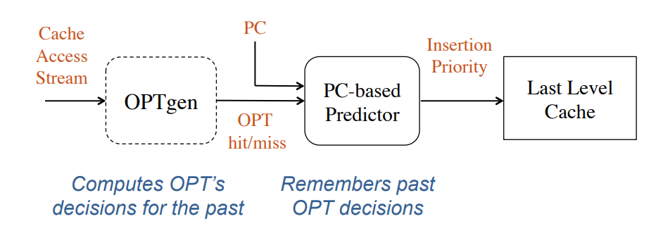
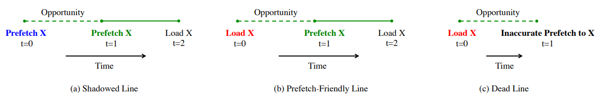
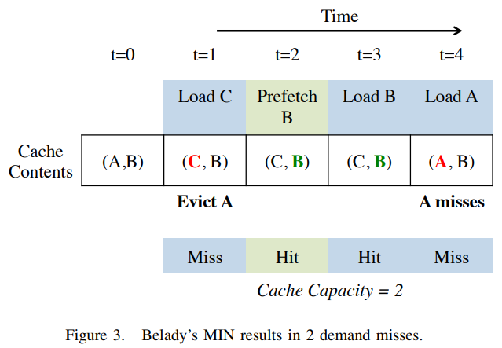
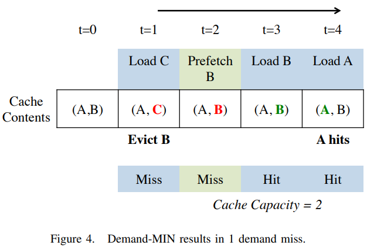
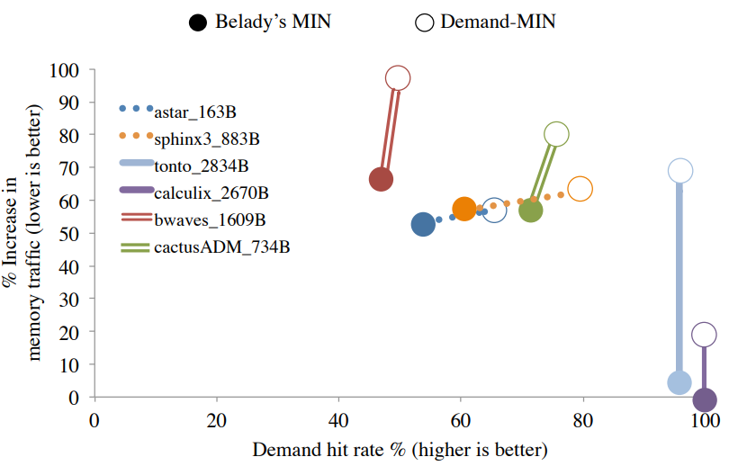
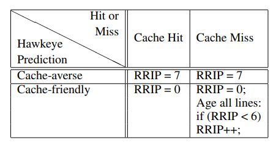

## 适应预取的Belady's近似算法
***

## 一、问题描述

Belady算法早已被证明是降低cache miss的最优cache替换方案。但是在有预取存在的情况下，Belady算法不能保证是降低demand miss的最优方案，因为belady没有区分prefetch miss和demand miss，即在需要替换的时候，belady无法区分**某个数据下次使用是prefetch还是demand**。




上图中D代表一次demand，P代表一次prefetch
如上图所示，实际上`*-P`(以P结尾)的间隔，对于提升demand hit rate没有任何帮助（因为他们未来会被预取）。因此如果想在有预取的情况下(即存在*-P间隔的情况下)，将demand hit rate最大化，就应该在替换时优先选择替换掉*-P的间隔。

但是对于某些应用，这种替换策略会造成内存访问的急剧增加。由于我们在替换时优先选择*-P的间隔，但这个数据未来也是要被预取的，预取他同样要从内存中取入cache，对于一些很短的*-P间隔(即马上就会被预取的数据)，此时踢出他显然不是明智之选。

因此现在的问题就是，如何平衡这种替换策略与内存访问增加，即如何选取合适的*-P间隔，让他既能保持较高的demand hit rate，又能保证内存访问不会急剧增加。

本文的贡献：
1. 分析了不同类型的*-P间隔被踢出时，带来的收益大小。
2. 提出了一种选择被踢出的*-P间隔的方法，可以尽量提高demand hit rate，同时能控制内存访问次数。
3. 在 hawkeye(一个belady's近似解的cache替换策略) 的基础上复现了Jain等人提出的harmony(一个基于hawkeye的有预取情况下提升demand hit rate的替换策略)，并在此基础上继续实现了本体提出的方案。


## 二、相关工作

### 1. Hawkeye(Jain&Lin, 2016)

Jain等人在2016年提出的hawkeye是一个通过求解过去的Belady-MIN解，来预测未来的替换策略。

Hawkeye 的核心见解是，虽然无法预测未来，但可以将 Belady 的 MIN 算法应用到过去的内存引用中。此外，如果一个程序过去的行为是它未来行为的一个很好的预测器，那么通过学习过去的最优解，Hawkeye 可以训练一个预测器，它应该在未来访问中表现良好。




上图为hawkeye的结构，其中
- OPTgen：OPTgen基于Belady算法回答一个数据是否已经被替换(即本次是hit还是miss)。他的核心思想是，已知一段时间每个数据的使用间隔(上次访问到本次访问的距离)，那么就可以知道每个时刻有多少个使用间隔重叠，如果重叠个数超过了cache size，那么就势必要有数据被踢出。OPTgen维护一个vector，存储某个时间点有多少重叠间隔，他的更换规则如下：
  - 数据 X 是首次访问，对应位置的 vector 值设置为 0，之前位置的 vector 不变。
  - 数据 X 是非首次访问，检查 vector 里的数据 X 使用间隔区间内各位置的值是否小于 cache 容量，是则 X 将被放入缓存中，将 vector 里的数据 X 使用间隔区间内各位置的值加 1，其余位置的值不变。否则 X 将会 miss，vector 不变。
- PC Predictor：PC Predictor是一个基于PC值的预测器，他根据OPTgen的返回值进行训练，如果OPTgen返回hit，PC Predictor为对应的PC值正向训练，否则反向训练。
- Hawkeye：Hawkeye会参考PC Predictor对一个PC的预测值进行替换，被预测为缓存友好的行将以高优先级插入，而被预测为缓存厌恶的行将以低优先级插入
- 每次选取牺牲者时，都会优先选择缓存厌恶的行，缓存友好的行如果miss也会反向训练PC Predictor

总体来说，Hawkeye提供了一种近似Belady的方案。


### 2. Harmony(Jain&Lin, 2018)

在Hawkeye的基础上，Jain等人又提出了Harmony。本文的问题就是Harmony解决的问题。

下面这部分来源于本次实验的基础部分，关于Harmony的讲解与分析


#### 2.1 Demand-MIN

**核心思想：移除未来最远被预取的行**，因为他们未来还会被预取，预取后就不会影响demand miss了

作者把一个数据的访问分为Demand和Prefetch两种，对于Prefetch又分为accurate和inaccurate两种(accurate prefetch是指预取的数据在未来一定会被访问，inaccurate prefetch是指预取的数据在未来可能会被访问)。对某个数据连续两次访问之间的时间视为使用间隔，则可能出现以下几种间隔


上图中以P结尾的间隔就是Demand-MIN要移除的数据(即未来会被预取的数据，现在就踢出)
作者也将以P结尾的间隔做了区分
- Shadowed Line: 两次访问都是P
- Prefetch-Friendly Line: D->P，且P是accurate prefetch
- Dead Line: D->P，且P是inaccurate prefetch
  


所以Demand的策略就是，每次移除都选择上述三种以P结尾的间隔(代表的数据)，选间隔最长的那个(即最远被预取的那个)，如果没有以P结尾的间隔，则选择MIN的策略







Demand-MIN和MIN的对比示例

**存在的问题：** 显然这个算法是在只关注demand hit rate的情况下才是优秀的，实际上预取数据同样需要访问内存(或者下级cache)，优先踢出预取数据，假如这个数据马上就要预取，那么踢出他显然是不合理的。




上图展示了作者在一些应用上的实验结果(虚线表示Demand-MIN表现更好，双横线有提升但是提升不大，实线表示不仅没有提升demand hit rate，反而还严重增加了内存访问)，可以看到在某些应用上Demand-MIN表现很差


#### 2.2 Flex-MIN

基于上面的问题，作者提出了Flex-MIN，即在Demand-MIN和MIN之间权衡。

**核心思想：将一些移出后收益并不大的间隔保护起来**

由于Demand-MIN表现不好的本质原因是过分关注demand hit rate这个指标，导致一些马上被预取数据被踢出，导致内存访问急剧增加。

Flex-MIN 设定一个长度阈值，将一些以P结尾且间隔长度小于阈值的数据保护起来，这些数据被称为`Protected Line`，每次优先移除没有被保护以P结尾的间隔的数据，如果没有这样的间隔，则按照MIN的策略移除


**阈值的选择** 

LED: 未命中的D-D间隔的平均长度 / cache friendly的*-P间隔的平均长度

直观的说，LED可以代表上图中的斜率，阈值应设定为LED的2.5倍。当斜率增加时，Flex-MIN驱逐*-P间隔将更加保守

#### 2.3 Harmony

作者基于自己曾经的工作Hawkeye提出了Harmony，将Hawkeye使用MIN决策，而Harmony使用Flex-MIN决策


##### Harmony修改的部分
为了模拟Flex-MIN，我们修改了OPTgen以区分需求加载和预取，特别是*-P间隔和*-D间隔。只有当它们短于给定阈值时，FlexMINgen才允许*-P间隔被缓存。对于*-D间隔， FlexMINgen遵循与OPTgen相同的政策。
1. 使用FlexMINgen代替OPTgen，对于*-P的间隔，只有小于给定阈值时，FlexMINgen才允许*-P间隔被缓存
2. 当遇到长度大于阈值的*-P间隔，predictor会进行负面学习
3. 为了计算LED值，增加了一些计数器

***

## 三、解决方案

我们之所以要把*-P的间隔移除，是因为他的存在会抢占*-D间隔的位置，导致未来的一个*-D间隔因为保留了*-P间隔发生miss，进而导致demand hit rate降低。所以一个自然的想法就是，我们可以看看某一个*-P会对未来多少个*-D间隔产生影响。


如上图所示，D1、D2、D3分别是三个*-D间隔，P是一个*-P间隔。

由于P的结束发生在D1结束之后，因此当查看P是否会发生miss的时候，自然已经计算过了D1。因此即使P是hit，也不会对D1的命中产生影响。

对于D2和D3来说，如果P为hit，那么T2到T3这段时间的间隔就增加1，可能会导致D2和D3因为P留在cache中而被挤掉。

那么我们就可以先假设P在Belady的策略下(即不区分prefetch和demand)为hit的时候真的让他hit，并记录下间隔P的信息，假如未来多个*-D间隔发生了miss，且都与P有重叠，就说明P导致了*-D被挤出cache，此时回溯间隔P的信息，令其miss，并重新计算未来那些*-D的是hit还是miss。

***

## 四、实验设置

本次实验的代码基于hawkeye实现，使用的模拟器为[ChampSim(for 2nd Cache Replacement)](https://www.dropbox.com/s/o6ct9p7ekkxaoz4/ChampSim_CRC2_ver2.0.tar.gz?dl=1)，和原版ChampSim相比有一些已经预设好的配置。

我将我实现的替换器命名为Homony，它由三部分组成
- FlexMINgen: 回答某一个数据是hit还是miss
- Homony-Predictor: 根据FlexMINgen的返回结果对PC进行正向或负向训练，并回答某个PC值是cache-friendly还是cache-averse
- Homony: 选出部分cache set作为样本，在样本组中训练predictor、计算各种评价指标；根据predictor的预测结果选取牺牲者等

### FlexMINgen

FlexMINgen的基本架构和OPTgen相同，他维护了一个vector，存储某个时间点有多少重叠间隔。

如果判断的间隔是*-D，他的更换规则如下：
  - 数据 X 是首次访问，对应位置的 vector 值设置为 0，之前位置的 vector 不变。
  - 数据 X 是非首次访问，检查 vector 里的数据 X 使用间隔区间内各位置的值是否小于 cache 容量，是则 X 将被放入缓存中，将 vector 里的数据 X 使用间隔区间内各位置的值加 1，其余位置的值不变。否则 X 将会 miss，vector 不变。
  - 如果数据 X 发生miss，则遍历存储*-P间隔的vector，如果导致数据 X 发生miss的时刻与某一个*-P间隔重叠，则把这个*-D间隔加入到这个*-P间隔的set中，等待后续回溯。

FlexMINgen还维护一个*-P间隔的vector `p_intervals`，其元素如下

```c++
struct PInterval{
    uint64_t start;//*-P间隔起始
    uint64_t end;//*-P间隔结束
    uint32_t counter;//*-P间隔已经向后查找了几个*-D间隔
    set<DInterval> hurt_d;//因为该间隔而miss的*-D间隔

    bool is_inval(uint64_t val){//判断某个时刻是否重叠
        if(val >= start && val <= end){
            return true;
        }
        return false;
    }
};
```

其中`counter`是该*-P间隔在vector中存在的最长时间，当足够多个*-D与他比较后仍没有超过限制而被回溯，则将该*-P间隔弹出，后续不再比较他。
`hert_d`保存的是因为该*-P而发生miss的*-D间隔，当该*-P间隔影响的*-D间隔数量超过限制，就会回溯该*-P间隔以及该set中的*-D间隔

如果某个*-P间隔没有发生miss，那么就先令他hit(对应时刻都+1)，并把他加入到 `p_intervals` 中

当某个*-P间隔发生回溯，首先将该*-P间隔对应时刻都-1，然后遍历他存储*-D间隔的set(按照间隔结束时刻的顺序遍历)，重新判断hit or miss。

对于重新判断为hit的*-D间隔，把他们的PC都存储在一个vector中，并返回给homony，homony需要对这些PC值重新正向训练(双倍训练，要把之前负向训练的损失补回来)


### Homony-Predictor

Predictor是一个基于PC的预测器，每一个PC保存一个预测值。正向训练时，预测值+1，负向训练时，预测值-1，如果预测值低于中间值则判定为cache averse，高于中间值则判定为cache friendly。

### Homony

Homony根据FlexMINgen对Predictor进行训练，并根据Predictor判断某个数据是cache-averse还是cache-friendly。



对于cache-averse和cache-friendly的数据分别采用上图中的更新方式，每次选择牺牲者的时候优先选择RRIP大的数据


## 五、实验结果

替换器部署在LLC上
ChampSim配置为单核，带有2MB LLC，具有L1/L2数据预取器
使用数据集为SPEC CPU 2006 benchmarks中的bzip2_10M.trace


<div style="page-break-before: always;"></div>


在hawkeye上的运行结果
```
CPU 0 cummulative IPC: 0.809948 instructions: 200000000 cycles: 246929457
LLC TOTAL     ACCESS:    3358015  HIT:    3312474  MISS:      45541
LLC LOAD      ACCESS:    1128509  HIT:    1119054  MISS:       9455
LLC RFO       ACCESS:     329111  HIT:     307110  MISS:      22001
LLC PREFETCH  ACCESS:    1458090  HIT:    1444468  MISS:      13622
LLC WRITEBACK ACCESS:     442305  HIT:     441842  MISS:        463
Demand Hit Rate: 51.8994
Final OPTGen Hits: 30185
Final OPTGen Access: 23431
Final OPTGEN Hit Rate: 128.825
```

使用自己构建的homony的运行结果
```
CPU 0 cummulative IPC: 0.81153 instructions: 200000000 cycles: 246448040
LLC TOTAL     ACCESS:    3143789  HIT:    3058902  MISS:      84887
LLC LOAD      ACCESS:    1007835  HIT:     995154  MISS:      12681
LLC RFO       ACCESS:     335792  HIT:     317891  MISS:      17901
LLC PREFETCH  ACCESS:    1345167  HIT:    1305123  MISS:      40044
LLC WRITEBACK ACCESS:     454995  HIT:     440734  MISS:      14261
Demand Hit Rate: 98.3906
```


复现harmony的运行结果
```
CPU 0 cummulative IPC: 0.808869 instructions: 200000000 cycles: 247258874
LLC TOTAL     ACCESS:    3357188  HIT:    3292671  MISS:      64517
LLC LOAD      ACCESS:    1128653  HIT:    1117215  MISS:      11438
LLC RFO       ACCESS:     329144  HIT:     313391  MISS:      15753
LLC PREFETCH  ACCESS:    1457053  HIT:    1427492  MISS:      29561
LLC WRITEBACK ACCESS:     442338  HIT:     434573  MISS:       7765
Demand Hit Rate: 98.4641
```


可以看到在此数据集上，使用本文提出的homony与作者实现的harmony在demand hit rate上相差不大，但是内存访问数略有下降